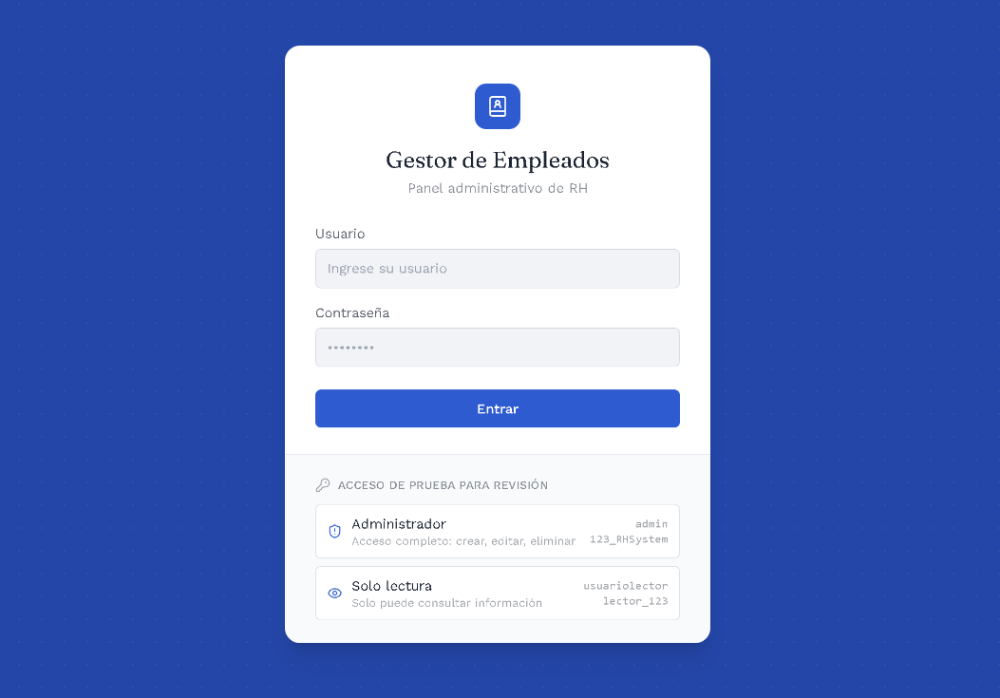
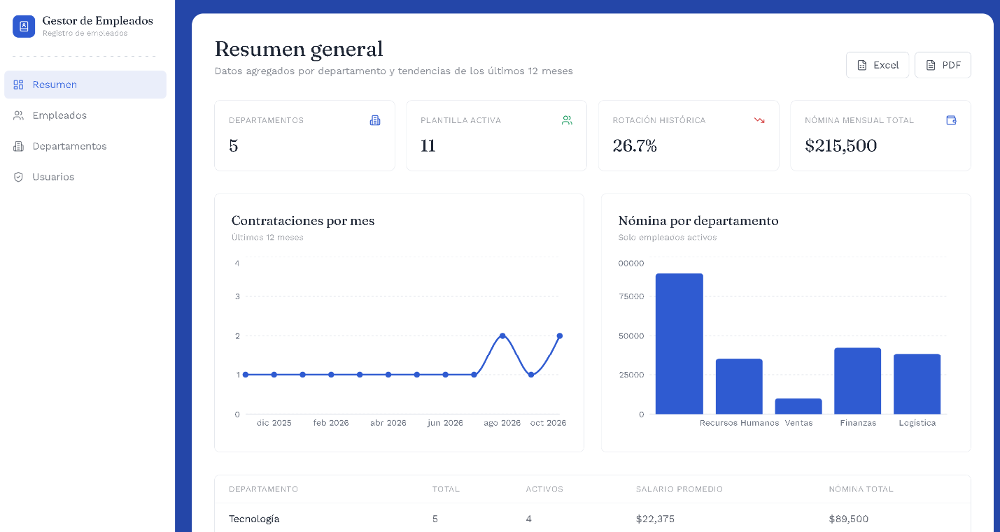
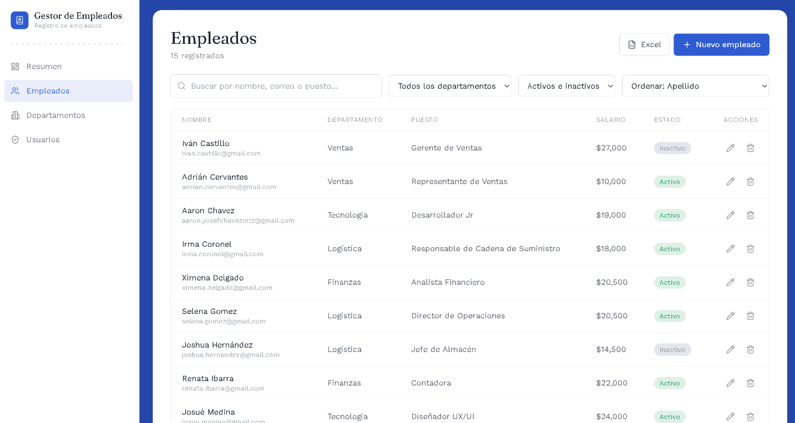
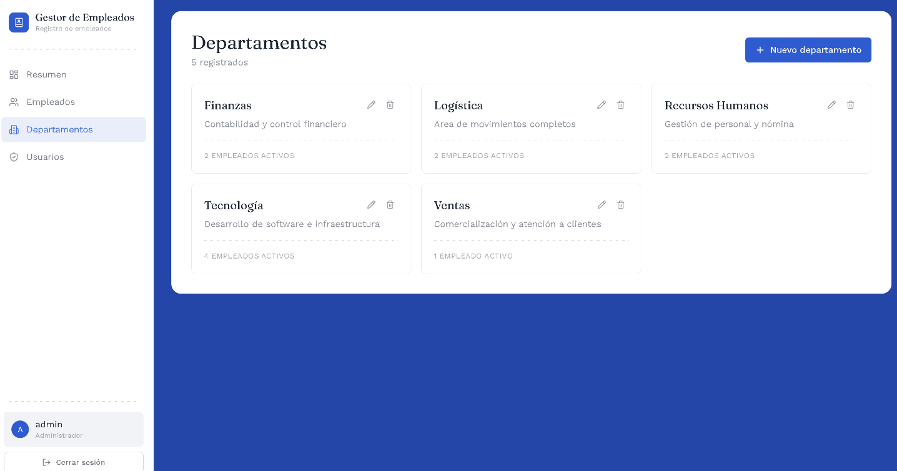
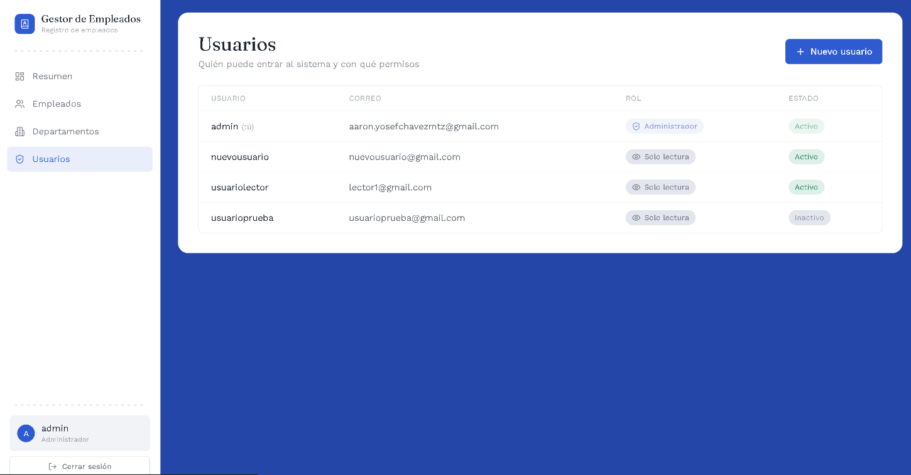

# Gestor de Empleados — Frontend


Interfaz web para administrar empleados y departamentos: login con roles, búsqueda y filtros en tiempo real, perfil de empleado con historial de cambios, dashboard con KPIs y reportes exportables. Consume la [API en ASP.NET Core + SQL Server](https://github.com/AaronChavezMtz/EmployeeManagementApi).

**🔗 Demo en vivo:** [Frontend](https://employeemanagementfrontend-grq5.onrender.com) · **API y Swagger:** [Backend](https://employeemanagementapi-vyx6.onrender.com)
**📦 Repositorio del backend:** [EmployeeManagementApi](https://github.com/AaronChavezMtz/EmployeeManagementApi)

> **Acceso de prueba para revisión:**
>
> | Rol | Usuario | Contraseña | Permisos |
> |---|---|---|---|
> | Administrador | `admin` | `123_RHSystem` | Acceso completo: crear, editar y eliminar |
> | Solo lectura | `usuariolector` | `lector_123` | Solo puede consultar información |
>
> *Nota: la API corre en un plan gratuito y puede tardar ~30-60 s en responder la primera vez. Los datos de la demo son ficticios; no registres información real.*

---

## Tabla de contenidos

- [Capturas de pantalla](#capturas-de-pantalla)
- [Funcionalidades](#funcionalidades)
- [Permisos por rol](#permisos-por-rol)
- [Decisiones técnicas](#decisiones-técnicas)
- [Stack](#stack)
- [Estructura del proyecto](#estructura-del-proyecto)
- [Cómo correrlo en local](#cómo-correrlo-en-local)
- [Scripts disponibles](#scripts-disponibles)
- [Build de producción](#build-de-producción)
- [Despliegue](#despliegue)
- [Roadmap](#roadmap)
- [Autor](#autor)

---

## Capturas de pantalla

### Inicio de sesión

<p align="center">
  
</p>

### Dashboard

<p align="center">
  
</p>

### Gestión de empleados

<p align="center">
  
</p>

### Gestión de departamentos

<p align="center">
  
</p>

### Gestión de usuarios

<p align="center">
  
</p>

## Funcionalidades

- **Autenticación JWT** con dos roles (Administrador / Solo lectura) — la interfaz oculta acciones de escritura según el rol, y la API las bloquea igualmente del lado del servidor
- **Empleados**: listado con búsqueda, filtros (departamento, estado, salario), orden y paginación; alta/edición con validación; perfil individual con línea de tiempo de cambios
- **Departamentos**: CRUD en modal, con conteo de empleados activos
- **Usuarios**: panel de administración de cuentas y roles (solo Admin)
- **Dashboard**: plantilla activa, rotación de personal, tendencia de contrataciones (gráfica), nómina por departamento
- **Exportación** de reportes a Excel y PDF
- **Manejo de errores centralizado**: distingue errores de red (API no disponible) de errores de negocio, con notificaciones (toast) para confirmar cada acción
- **Responsivo**: menú lateral colapsable en móvil/tablet, tablas con scroll horizontal

## Permisos por rol

| Acción | Administrador | Solo lectura |
|---|:---:|:---:|
| Ver dashboard, empleados y departamentos | ✅ | ✅ |
| Buscar, filtrar y ver historial | ✅ | ✅ |
| Exportar reportes | ✅ | ✅ |
| Crear / editar / dar de baja empleados | ✅ | ❌ |
| Gestionar departamentos | ✅ | ❌ |
| Gestionar usuarios y roles | ✅ | ❌ |

La interfaz refleja estos permisos, pero **la autorización real vive en la API**: aunque alguien manipule el frontend, el servidor rechaza cualquier acción no permitida.

## Decisiones técnicas

| Decisión | Motivo |
|---|---|
| **Módulo de API por recurso** (`src/api`) | Aísla las llamadas HTTP de la UI; cambiar un endpoint toca un solo archivo. |
| **Instancia única de Axios con interceptores** | Adjunta el token a cada petición y centraliza el manejo de errores (sesión expirada, red caída, errores de negocio). |
| **Context API para sesión y notificaciones** | El estado global es pequeño; evita añadir una librería de estado innecesaria. |
| **`ProtectedRoute` por rol** | Protege rutas completas y evita renderizar vistas a usuarios sin permiso. |
| **Mensajes de error normalizados** (`utils`) | Una sola función traduce errores de la API a mensajes claros para el usuario. |
| **Tailwind CSS** | Estilos consistentes y diseño responsivo sin CSS disperso. |
| **Recharts** | Gráficas declarativas y ligeras para las tendencias del dashboard. |

## Stack

React 18 · Vite · React Router · Tailwind CSS · Axios · Recharts · Lucide React

## Estructura del proyecto

```
src/
├── pages/        Una página por ruta (Login, Dashboard, Empleados, Departamentos, Usuarios...)
├── components/   Componentes reutilizables (Layout, Spinner, ConfirmDialog, ProtectedRoute)
├── context/      Estado global (sesión del usuario, notificaciones)
├── api/          Llamadas HTTP a la API, un módulo por recurso
└── utils/        Utilidades compartidas (manejo de mensajes de error)
```

## Cómo correrlo en local

### Requisitos

- Node.js 18+
- La [API](https://github.com/AaronChavezMtz/EmployeeManagementApi) corriendo (local o en producción)

### Pasos

```bash
git clone https://github.com/AaronChavezMtz/EmployeeManagementFrontend.git
cd EmployeeManagementFrontend
npm install
cp .env.example .env
```

Edita `.env` con la URL de tu API:

```
VITE_API_URL=http://localhost:8080/api
```

```bash
npm run dev
```

La app queda disponible en `http://localhost:5173`.

> **CORS:** agrega `http://localhost:5173` a `AllowedOrigins` en la API para poder usarla en desarrollo.

## Scripts disponibles

| Comando | Descripción |
|---|---|
| `npm run dev` | Servidor de desarrollo con recarga en caliente |
| `npm run build` | Build de producción en `dist/` |
| `npm run preview` | Sirve localmente el build de producción |
| `npm run lint` | `TODO: elimina esta fila si no tienes lint configurado` |

## Build de producción

```bash
npm run build
```

Genera la carpeta `dist/` lista para servir como sitio estático.

## Despliegue

Compatible con cualquier hosting de sitios estáticos (Vercel, Render Static Sites, Netlify). Dos cosas a configurar en la plataforma elegida:

- Variable de entorno `VITE_API_URL` apuntando a la API en producción (se usa en tiempo de build, no de ejecución — cambiarla requiere un nuevo deploy)
- Una regla de *rewrite* que sirva `index.html` para cualquier ruta (necesario porque el ruteo lo maneja React Router del lado del cliente)

```
Cliente (Render Static) ──► API ASP.NET Core (Render, Docker) ──► Azure SQL Database
```

## Roadmap

- [ ] Modo oscuro
- [ ] Pruebas de componentes con Vitest + React Testing Library
- [ ] Pruebas E2E con Playwright
- [ ] Internacionalización (ES / EN)
- [ ] Mejoras de accesibilidad (auditoría con Lighthouse)
- [ ] Pipeline de CI con GitHub Actions

## Autor

**Aarón Yosef Chávez Martínez** · [GitHub](https://github.com/AaronChavezMtz) · [LinkedIn](https://www.linkedin.com/in/aaron-chavez-99bbb8393)

## Licencia

Distribuido bajo la licencia MIT — ver [LICENSE](LICENSE).